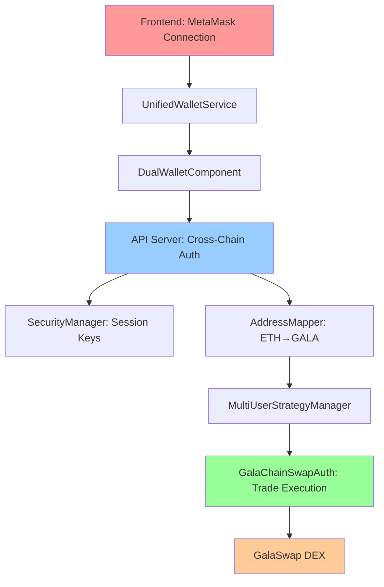
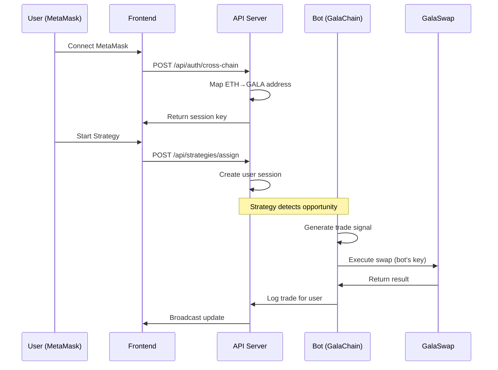

# 🦊 MetaMask Integration Guide for Fafnir Bot

## 📋 Table of Contents
1. [Overview](#overview)
2. [Architecture](#architecture)
3. [Authentication Flow](#authentication-flow)
4. [Transaction Execution](#transaction-execution)
5. [Frontend Integration](#frontend-integration)
6. [Backend Implementation](#backend-implementation)
7. [API Endpoints](#api-endpoints)
8. [WebSocket Integration](#websocket-integration)
9. [Security Model](#security-model)
10. [Error Handling](#error-handling)
11. [Testing & Troubleshooting](#testing--troubleshooting)

---

## 🌟 Overview

The Fafnir Bot supports **dual wallet integration** allowing users to connect with either:
- **🦊 MetaMask** (Ethereum-based) with cross-chain support
- **⚡ Gala Wallet** (native GalaChain)

This guide focuses on the **MetaMask integration** which enables Ethereum users to trade on GalaSwap through cross-chain authentication and address mapping.

### Key Features
- ✅ One-click MetaMask connection
- ✅ Cross-chain authentication (Ethereum → GalaChain)
- ✅ Deterministic address mapping
- ✅ Session-based API authentication
- ✅ Real-time trade execution
- ✅ Multi-user support with isolated sessions

---

## 🏗️ Architecture



### Component Roles

| Component | Responsibility |
|-----------|---------------|
| **UnifiedWalletService** | Wallet detection, connection, message signing |
| **DualWalletComponent** | High-level wallet management and authentication |
| **API Server** | Cross-chain authentication and session management |
| **SecurityManager** | Session API keys and CORS security |
| **AddressMapper** | Ethereum ↔ GalaChain address conversion |
| **MultiUserStrategyManager** | Per-user strategy isolation and management |
| **GalaChainSwapAuth** | Actual trade execution on GalaSwap |

---

## 🔐 Authentication Flow

### 1. Frontend Wallet Connection

```javascript
// Frontend: Detect and connect MetaMask
const walletService = new UnifiedWalletService();

// Check if MetaMask is available
if (window.ethereum && window.ethereum.isMetaMask) {
    console.log('🦊 MetaMask detected');

    // Connect wallet
    const connection = await walletService.connectWallet(WalletType.METAMASK);
    console.log('Connected:', connection);

    // connection.address = "0x742d35cc6abcd234..."
    // connection.galaChainAddress = "eth|742d35cc6abcd234..."
}
```

### 2. Message Signing for Authentication

```javascript
// Frontend: Sign authentication message
const dualWallet = new DualWalletComponent({
    apiBaseUrl: 'https://your-api.com'
});

// This triggers MetaMask signature popup
const authResult = await dualWallet.authenticate();

if (authResult.success) {
    console.log('✅ Authenticated with session key:', authResult.sessionApiKey);
    // Store session key for API calls
    localStorage.setItem('fafnir_session', authResult.sessionApiKey);
}
```

### 3. Backend Cross-Chain Authentication

```typescript
// Backend: API Server endpoint
app.post('/api/auth/cross-chain', async (req, res) => {
    const {
        ethereumAddress,     // 0x742d35...
        ethereumSignature,   // MetaMask signature
        message,             // Original message
        walletType,          // 'metamask'
        nftVerified
    } = req.body;

    // 1. Verify Ethereum signature
    const isValid = await verifyEthereumSignature(
        ethereumAddress,
        ethereumSignature,
        message
    );

    if (!isValid) {
        return res.status(401).json({ error: 'Invalid signature' });
    }

    // 2. Map Ethereum address to GalaChain format
    const galaChainAddress = await getOrCreateGalaChainMapping(ethereumAddress);
    // Result: "eth|742d35cc6abcd234..."

    // 3. Generate session API key
    const sessionApiKey = securityManager.generateSessionApiKey(galaChainAddress);

    res.json({
        success: true,
        sessionApiKey,
        ethereumAddress,
        galaChainAddress,
        walletType: 'metamask',
        expiresIn: '24h'
    });
});
```

---

## 💱 Transaction Execution

### How MetaMask Users Execute Trades

The key insight is that **MetaMask users don't directly sign GalaChain transactions**. Instead:

1. **Authentication**: MetaMask signs an authentication message
2. **Session**: Backend creates a session linked to their mapped GalaChain address
3. **Bot Trading**: The bot executes trades **on behalf of the user** using the bot's GalaChain private key
4. **Attribution**: All trades are attributed to the user's mapped address for tracking/logging

```typescript
// Backend: Trade execution flow
class MultiUserStrategyManager {
    async executeTradeForUser(walletAddress: string, tradeParams: any) {
        // walletAddress = "eth|742d35cc6abcd234..." (mapped from MetaMask)

        // 1. Verify user has active session
        const session = this.getUserSession(walletAddress);
        if (!session) throw new Error('No active session');

        // 2. Execute trade using bot's credentials but attribute to user
        const swapAuth = new GalaChainSwapAuth(); // Uses bot's private key
        const result = await swapAuth.executeSwap({
            tokenIn: tradeParams.tokenIn,
            tokenOut: tradeParams.tokenOut,
            amountIn: tradeParams.amountIn,
            recipient: walletAddress  // Trade attributed to user's address
        });

        // 3. Log trade for user's history
        await this.logUserTrade(walletAddress, result);

        return result;
    }
}
```

### Trading Architecture



---

## 🎯 Frontend Integration

### Complete MetaMask Integration Example

```html
<!DOCTYPE html>
<html>
<head>
    <title>Fafnir Bot - MetaMask Integration</title>
</head>
<body>
    <div id="wallet-status">
        <button id="connect-metamask">🦊 Connect MetaMask</button>
        <div id="wallet-info" style="display: none;">
            <p>Ethereum: <span id="eth-address"></span></p>
            <p>GalaChain: <span id="gala-address"></span></p>
            <p>Status: <span id="connection-status"></span></p>
        </div>
    </div>

    <div id="trading-controls" style="display: none;">
        <h3>Strategy Selection</h3>
        <select id="strategy-select">
            <option value="fafnir-treasure-hoarder">Fafnir Treasure Hoarder</option>
            <option value="fibonacci">DCA Fibonacci</option>
            <option value="arbitrage">Arbitrage</option>
        </select>
        <button id="start-strategy">Start Trading</button>
        <button id="stop-strategy">Stop Trading</button>
    </div>

    <div id="trade-log"></div>

    <script>
        class FafnirMetaMaskIntegration {
            constructor() {
                this.apiBaseUrl = 'http://localhost:3000';
                this.sessionKey = null;
                this.walletAddress = null;
                this.websocket = null;

                this.init();
            }

            async init() {
                // Check if already connected
                const savedSession = localStorage.getItem('fafnir_session');
                if (savedSession) {
                    this.sessionKey = savedSession;
                    await this.validateSession();
                }

                this.setupEventListeners();
                this.checkMetaMaskAvailability();
            }

            checkMetaMaskAvailability() {
                if (window.ethereum && window.ethereum.isMetaMask) {
                    console.log('🦊 MetaMask available');
                } else {
                    alert('MetaMask not detected. Please install MetaMask to continue.');
                }
            }

            setupEventListeners() {
                document.getElementById('connect-metamask').addEventListener('click', () => {
                    this.connectMetaMask();
                });

                document.getElementById('start-strategy').addEventListener('click', () => {
                    this.startStrategy();
                });

                document.getElementById('stop-strategy').addEventListener('click', () => {
                    this.stopStrategy();
                });
            }

            async connectMetaMask() {
                try {
                    console.log('🔌 Connecting to MetaMask...');

                    // Request account access
                    const accounts = await window.ethereum.request({
                        method: 'eth_requestAccounts'
                    });

                    const ethereumAddress = accounts[0];
                    console.log('✅ MetaMask connected:', ethereumAddress);

                    // Create authentication message
                    const message = `Authenticate with Fafnir Bot at ${new Date().toISOString()}`;

                    // Sign message with MetaMask
                    const signature = await window.ethereum.request({
                        method: 'personal_sign',
                        params: [message, ethereumAddress]
                    });

                    console.log('📝 Message signed');

                    // Authenticate with backend
                    const authResponse = await fetch(`${this.apiBaseUrl}/api/auth/cross-chain`, {
                        method: 'POST',
                        headers: {
                            'Content-Type': 'application/json'
                        },
                        body: JSON.stringify({
                            ethereumAddress,
                            ethereumSignature: signature,
                            message,
                            walletType: 'metamask',
                            nftVerified: true
                        })
                    });

                    const authData = await authResponse.json();

                    if (authData.success) {
                        this.sessionKey = authData.sessionApiKey;
                        this.walletAddress = authData.galaChainAddress;

                        // Store session
                        localStorage.setItem('fafnir_session', this.sessionKey);

                        // Update UI
                        this.updateWalletUI(ethereumAddress, authData.galaChainAddress, 'Connected');
                        this.connectWebSocket();

                        console.log('🎉 Authentication successful!');
                    } else {
                        throw new Error(authData.error || 'Authentication failed');
                    }

                } catch (error) {
                    console.error('❌ MetaMask connection failed:', error);
                    alert(`Connection failed: ${error.message}`);
                }
            }

            updateWalletUI(ethAddress, galaAddress, status) {
                document.getElementById('eth-address').textContent = ethAddress;
                document.getElementById('gala-address').textContent = galaAddress;
                document.getElementById('connection-status').textContent = status;

                document.getElementById('wallet-info').style.display = 'block';
                document.getElementById('trading-controls').style.display = 'block';
                document.getElementById('connect-metamask').style.display = 'none';
            }

            async startStrategy() {
                try {
                    const strategy = document.getElementById('strategy-select').value;

                    const response = await fetch(`${this.apiBaseUrl}/api/strategies/assign`, {
                        method: 'POST',
                        headers: {
                            'Content-Type': 'application/json',
                            'Authorization': `Bearer ${this.sessionKey}`
                        },
                        body: JSON.stringify({
                            walletAddress: this.walletAddress,
                            strategy
                        })
                    });

                    const result = await response.json();

                    if (result.success) {
                        console.log('🚀 Strategy started:', strategy);
                        this.addLogEntry(`Strategy ${strategy} started successfully`);
                    } else {
                        throw new Error(result.error || 'Failed to start strategy');
                    }

                } catch (error) {
                    console.error('❌ Strategy start failed:', error);
                    alert(`Failed to start strategy: ${error.message}`);
                }
            }

            async stopStrategy() {
                try {
                    const response = await fetch(`${this.apiBaseUrl}/api/strategies/${this.walletAddress}/control`, {
                        method: 'POST',
                        headers: {
                            'Content-Type': 'application/json',
                            'Authorization': `Bearer ${this.sessionKey}`
                        },
                        body: JSON.stringify({
                            action: 'stop'
                        })
                    });

                    const result = await response.json();

                    if (result.success) {
                        console.log('🛑 Strategy stopped');
                        this.addLogEntry('Strategy stopped successfully');
                    } else {
                        throw new Error(result.error || 'Failed to stop strategy');
                    }

                } catch (error) {
                    console.error('❌ Strategy stop failed:', error);
                    alert(`Failed to stop strategy: ${error.message}`);
                }
            }

            connectWebSocket() {
                const wsUrl = this.apiBaseUrl.replace('http', 'ws');
                this.websocket = new WebSocket(wsUrl);

                this.websocket.onopen = () => {
                    console.log('🔗 WebSocket connected');

                    // Authenticate WebSocket with session
                    this.websocket.send(JSON.stringify({
                        type: 'authenticate',
                        sessionKey: this.sessionKey,
                        walletAddress: this.walletAddress
                    }));
                };

                this.websocket.onmessage = (event) => {
                    const data = JSON.parse(event.data);
                    this.handleWebSocketMessage(data);
                };

                this.websocket.onclose = () => {
                    console.log('🔌 WebSocket disconnected');
                    // Attempt reconnection after 3 seconds
                    setTimeout(() => this.connectWebSocket(), 3000);
                };
            }

            handleWebSocketMessage(data) {
                switch (data.type) {
                    case 'trade_execution':
                        if (data.data.walletAddress === this.walletAddress) {
                            this.addLogEntry(`Trade: ${data.data.action} ${data.data.amount} ${data.data.pair} - ${data.data.success ? 'Success' : 'Failed'}`);
                        }
                        break;

                    case 'strategy_update':
                        if (data.data.walletAddress === this.walletAddress) {
                            this.addLogEntry(`Strategy update: ${data.data.status}`);
                        }
                        break;

                    case 'oracle_transmission':
                        this.addLogEntry(`Oracle: ${data.data.message}`);
                        break;
                }
            }

            addLogEntry(message) {
                const logDiv = document.getElementById('trade-log');
                const timestamp = new Date().toLocaleTimeString();
                logDiv.innerHTML += `<div>[${timestamp}] ${message}</div>`;
                logDiv.scrollTop = logDiv.scrollHeight;
            }

            async validateSession() {
                try {
                    const response = await fetch(`${this.apiBaseUrl}/api/strategies/list`, {
                        headers: {
                            'Authorization': `Bearer ${this.sessionKey}`
                        }
                    });

                    if (response.ok) {
                        console.log('✅ Session valid');
                        return true;
                    } else {
                        this.clearSession();
                        return false;
                    }
                } catch (error) {
                    this.clearSession();
                    return false;
                }
            }

            clearSession() {
                this.sessionKey = null;
                this.walletAddress = null;
                localStorage.removeItem('fafnir_session');
            }
        }

        // Initialize the integration
        const fafnir = new FafnirMetaMaskIntegration();
    </script>
</body>
</html>
```

---

## 🔧 Backend Implementation

### API Server Cross-Chain Authentication

```typescript
// src/api-server.ts
export class ApiServer {
    private addressMappings: Map<string, string> = new Map();

    private setupAuthenticationRoutes() {
        // Cross-chain authentication endpoint
        this.app.post('/api/auth/cross-chain', async (req: Request, res: Response) => {
            try {
                const {
                    ethereumAddress,
                    ethereumSignature,
                    message,
                    walletType,
                    nftVerified
                } = req.body;

                // Validate required fields
                if (!ethereumAddress || !ethereumSignature || !message) {
                    return this.sendError(res, 'Missing required fields', 400);
                }

                // Verify Ethereum signature
                const isValid = await this.verifyEthereumSignature(
                    ethereumAddress,
                    ethereumSignature,
                    message
                );

                if (!isValid) {
                    return this.sendError(res, 'Invalid signature', 401);
                }

                // Get or create GalaChain address mapping
                const galaChainAddress = await this.getOrCreateGalaChainMapping(ethereumAddress);

                // Generate session API key
                const sessionApiKey = securityManager.generateSessionApiKey(galaChainAddress);

                // Store user session for multi-user manager
                await this.multiUserStrategyManager.createUserSession({
                    walletAddress: galaChainAddress,
                    ethereumAddress,
                    sessionKey: sessionApiKey,
                    walletType: 'metamask'
                });

                this.sendResponse(res, {
                    success: true,
                    sessionApiKey,
                    ethereumAddress,
                    galaChainAddress,
                    walletType: 'metamask',
                    expiresIn: '24h',
                    message: 'Cross-chain authentication successful'
                });

                console.log(`✅ Cross-chain auth: ${ethereumAddress} → ${galaChainAddress}`);

            } catch (error: any) {
                console.error('❌ Cross-chain auth error:', error);
                this.sendError(res, error.message, 500);
            }
        });
    }

    private async verifyEthereumSignature(
        address: string,
        signature: string,
        message: string
    ): Promise<boolean> {
        try {
            const recoveredAddress = ethers.utils.verifyMessage(message, signature);
            return recoveredAddress.toLowerCase() === address.toLowerCase();
        } catch (error) {
            console.error('Signature verification failed:', error);
            return false;
        }
    }

    private async getOrCreateGalaChainMapping(ethereumAddress: string): Promise<string> {
        const normalizedEthAddress = ethereumAddress.toLowerCase();

        // Check existing mapping
        let galaChainAddress = this.addressMappings.get(normalizedEthAddress);

        if (!galaChainAddress) {
            // Create deterministic mapping: eth|<ethereum_address_without_0x>
            galaChainAddress = `eth|${normalizedEthAddress.slice(2)}`;

            // Store mapping
            this.addressMappings.set(normalizedEthAddress, galaChainAddress);

            console.log(`🔗 New address mapping: ${normalizedEthAddress} → ${galaChainAddress}`);
        }

        return galaChainAddress;
    }
}
```

### Multi-User Strategy Manager Integration

```typescript
// src/multi-user-strategy-manager.ts
export class MultiUserStrategyManager {
    private userSessions: Map<string, UserSession> = new Map();

    async createUserSession(params: {
        walletAddress: string;
        ethereumAddress?: string;
        sessionKey: string;
        walletType: 'metamask' | 'galachain';
    }): Promise<UserSession> {
        const session: UserSession = {
            walletAddress: params.walletAddress,
            ethereumAddress: params.ethereumAddress,
            sessionKey: params.sessionKey,
            walletType: params.walletType,
            isActive: false,
            selectedStrategy: null,
            sessionId: crypto.randomUUID(),
            startTime: null,
            lastActivity: new Date().toISOString(),
            config: {},
            performance: {
                totalTrades: 0,
                successfulTrades: 0,
                totalProfit: 0,
                totalLoss: 0
            }
        };

        this.userSessions.set(params.walletAddress, session);

        console.log(`👤 User session created: ${params.walletAddress} (${params.walletType})`);

        return session;
    }

    async assignStrategy(request: StrategyAssignmentRequest): Promise<UserSession> {
        const session = this.userSessions.get(request.walletAddress);

        if (!session) {
            throw new Error('User session not found. Please authenticate first.');
        }

        // Stop any existing strategy
        if (session.isActive && session.selectedStrategy) {
            await this.stopUserStrategy(request.walletAddress);
        }

        // Start new strategy
        session.selectedStrategy = request.strategy;
        session.isActive = true;
        session.startTime = Date.now();
        session.lastActivity = new Date().toISOString();

        // Initialize strategy instance for this user
        const strategyInstance = this.createStrategyInstance(request.strategy);
        this.activeStrategies.set(request.walletAddress, strategyInstance);

        // Start strategy execution
        this.executeUserStrategy(request.walletAddress, strategyInstance);

        console.log(`🚀 Strategy assigned: ${request.strategy} for ${request.walletAddress}`);

        return session;
    }

    private async executeUserStrategy(walletAddress: string, strategy: TradingStrategy): Promise<void> {
        // This runs the strategy on behalf of the user
        // All trades are executed using the bot's credentials but attributed to the user

        while (this.isUserStrategyActive(walletAddress)) {
            try {
                // Generate trading signal for this user
                const signal = await strategy.analyze();

                if (signal.shouldTrade) {
                    // Execute trade using bot's GalaChain credentials
                    const swapAuth = new GalaChainSwapAuth();
                    const result = await swapAuth.executeSwap({
                        tokenIn: signal.tokenIn,
                        tokenOut: signal.tokenOut,
                        amountIn: signal.amountIn,
                        // Important: Trade is attributed to user's address
                        recipient: walletAddress
                    });

                    // Log trade for user's history
                    await this.logUserTrade(walletAddress, result);

                    // Broadcast trade execution
                    this.broadcastTradeExecution({
                        type: 'trade_execution',
                        data: {
                            walletAddress,
                            strategy: strategy.getName(),
                            ...result
                        }
                    });
                }

                // Wait before next analysis
                await this.sleep(30000); // 30 seconds

            } catch (error) {
                console.error(`❌ Strategy execution error for ${walletAddress}:`, error);
                await this.sleep(60000); // Wait longer on error
            }
        }
    }
}
```

---

## 🔌 API Endpoints

### Authentication Endpoints

| Method | Endpoint | Description |
|--------|----------|-------------|
| `POST` | `/api/auth/cross-chain` | Authenticate MetaMask wallet |
| `POST` | `/api/wallet/map-address` | Create/verify address mapping |
| `GET` | `/api/wallet/mapping/:ethereumAddress` | Get existing mapping |
| `POST` | `/api/wallet/verify-signature` | Verify wallet signature |

### Strategy Management Endpoints

| Method | Endpoint | Description |
|--------|----------|-------------|
| `POST` | `/api/strategies/assign` | Assign strategy to user |
| `POST` | `/api/strategies/:address/control` | Start/stop user strategy |
| `GET` | `/api/strategies/:address/status` | Get user strategy status |
| `PUT` | `/api/strategies/:address/config` | Update strategy config |

### Trading Data Endpoints

| Method | Endpoint | Description |
|--------|----------|-------------|
| `GET` | `/api/performance/:address` | Get user performance metrics |
| `GET` | `/api/trades/:address` | Get user trade history |
| `GET` | `/api/logs/wallet/:address` | Get user-specific logs |

### Example API Calls

```javascript
// 1. Authenticate MetaMask wallet
const authResponse = await fetch('/api/auth/cross-chain', {
    method: 'POST',
    headers: { 'Content-Type': 'application/json' },
    body: JSON.stringify({
        ethereumAddress: '0x742d35cc...',
        ethereumSignature: '0x8a7b2c...',
        message: 'Authenticate with Fafnir Bot at 2024-01-15T10:30:00.000Z',
        walletType: 'metamask',
        nftVerified: true
    })
});

// 2. Start trading strategy
const strategyResponse = await fetch('/api/strategies/assign', {
    method: 'POST',
    headers: {
        'Content-Type': 'application/json',
        'Authorization': `Bearer ${sessionApiKey}`
    },
    body: JSON.stringify({
        walletAddress: 'eth|742d35cc...',
        strategy: 'fafnir-treasure-hoarder'
    })
});

// 3. Get trade history
const tradesResponse = await fetch('/api/trades/eth|742d35cc...', {
    headers: {
        'Authorization': `Bearer ${sessionApiKey}`
    }
});
```

---

## 🔒 Security Model

### Session-Based Authentication

```typescript
// SecurityManager creates session keys linked to wallet addresses
class SecurityManager {
    generateSessionApiKey(walletAddress: string, duration: number = 24 * 60 * 60 * 1000): string {
        const sessionData = {
            wallet: walletAddress,
            created: Date.now(),
            expires: Date.now() + duration
        };

        const sessionKey = `session_${crypto.randomBytes(16).toString('hex')}_${walletAddress.slice(-6)}`;
        this.activeSessions.add(sessionKey);

        return sessionKey;
    }

    validateSessionApiKey(apiKey: string): boolean {
        return apiKey.startsWith('session_') && this.activeSessions.has(apiKey);
    }
}
```

### CORS Configuration

```typescript
// Allowed origins for cross-origin requests
const corsOrigins = [
    'https://yuphix.io',
    'http://localhost:3000',
    'http://localhost:3001',
    'http://127.0.0.1:3000'
];
```

### Signature Verification

```typescript
async function verifyEthereumSignature(
    address: string,
    signature: string,
    message: string
): Promise<boolean> {
    try {
        const recoveredAddress = ethers.utils.verifyMessage(message, signature);
        return recoveredAddress.toLowerCase() === address.toLowerCase();
    } catch (error) {
        return false;
    }
}
```

---

## 📡 WebSocket Integration

### Real-Time Updates

```javascript
// Frontend WebSocket connection
const wsUrl = 'ws://localhost:3000';
const websocket = new WebSocket(wsUrl);

websocket.onopen = () => {
    // Authenticate WebSocket connection
    websocket.send(JSON.stringify({
        type: 'authenticate',
        sessionKey: sessionApiKey,
        walletAddress: galaChainAddress
    }));
};

websocket.onmessage = (event) => {
    const data = JSON.parse(event.data);

    switch (data.type) {
        case 'trade_execution':
            // Real-time trade updates
            if (data.data.walletAddress === userWalletAddress) {
                updateTradeUI(data.data);
            }
            break;

        case 'strategy_update':
            // Strategy status changes
            updateStrategyStatus(data.data);
            break;

        case 'oracle_transmission':
            // Fantasy story updates
            displayOracleMessage(data.data);
            break;
    }
};
```

### Backend WebSocket Broadcasting

```typescript
// API Server broadcasts trade executions
private async broadcastTradeExecution(tradeEvent: any): Promise<void> {
    // Send to all connected WebSocket clients
    this.wss.clients.forEach((client) => {
        if (client.readyState === WebSocket.OPEN) {
            client.send(JSON.stringify(tradeEvent));
        }
    });
}
```

---

## ⚠️ Error Handling

### Common Error Scenarios

| Error | Cause | Solution |
|-------|-------|----------|
| `MetaMask not detected` | Extension not installed | Guide user to install MetaMask |
| `User rejected the request` | User cancelled signature | Retry authentication |
| `Invalid signature` | Signature verification failed | Re-sign authentication message |
| `Session expired` | API key expired | Re-authenticate |
| `Insufficient balance` | Not enough tokens | Check GalaChain wallet balance |

### Frontend Error Handling

```javascript
async function handleMetaMaskError(error) {
    if (error.code === 4001) {
        // User rejected request
        console.log('User cancelled the request');
        showUserMessage('Authentication cancelled. Please try again.');
    } else if (error.code === -32002) {
        // Request already pending
        console.log('MetaMask request already pending');
        showUserMessage('Please check MetaMask - a request is already pending.');
    } else if (error.message.includes('signature')) {
        // Signature error
        console.log('Signature verification failed');
        showUserMessage('Signature verification failed. Please try again.');
    } else {
        // Generic error
        console.error('MetaMask error:', error);
        showUserMessage(`Connection error: ${error.message}`);
    }
}
```

### Backend Error Responses

```typescript
// Standardized error responses
private sendError(res: Response, message: string, status: number = 400): void {
    res.status(status).json({
        success: false,
        error: message,
        timestamp: new Date().toISOString()
    });
}

// Example usage
if (!ethereumAddress) {
    return this.sendError(res, 'Ethereum address required', 400);
}

if (!sessionValid) {
    return this.sendError(res, 'Session expired - please re-authenticate', 401);
}
```

---

## 🧪 Testing & Troubleshooting

### Frontend Testing

```javascript
// Test MetaMask connection
async function testMetaMaskConnection() {
    console.log('🧪 Testing MetaMask connection...');

    // 1. Check if MetaMask is available
    if (!window.ethereum) {
        console.error('❌ MetaMask not available');
        return;
    }

    // 2. Check if already connected
    const accounts = await window.ethereum.request({ method: 'eth_accounts' });
    console.log('Current accounts:', accounts);

    // 3. Test signature
    if (accounts.length > 0) {
        const message = 'Test message';
        try {
            const signature = await window.ethereum.request({
                method: 'personal_sign',
                params: [message, accounts[0]]
            });
            console.log('✅ Signature successful:', signature);
        } catch (error) {
            console.error('❌ Signature failed:', error);
        }
    }
}
```

### Backend Testing

```bash
# Test cross-chain authentication endpoint
curl -X POST http://localhost:3000/api/auth/cross-chain \
  -H "Content-Type: application/json" \
  -d '{
    "ethereumAddress": "0x742d35cc6abcd234...",
    "ethereumSignature": "0x8a7b2c...",
    "message": "Authenticate with Fafnir Bot at 2024-01-15T10:30:00.000Z",
    "walletType": "metamask",
    "nftVerified": true
  }'

# Expected response:
# {
#   "success": true,
#   "sessionApiKey": "session_abc123...",
#   "ethereumAddress": "0x742d35cc6abcd234...",
#   "galaChainAddress": "eth|742d35cc6abcd234...",
#   "walletType": "metamask",
#   "expiresIn": "24h"
# }
```

### Common Issues & Solutions

#### 1. MetaMask Not Connecting
```javascript
// Check MetaMask availability
if (typeof window.ethereum === 'undefined') {
    console.log('MetaMask not installed');
    // Show installation guide
}

// Check network
const chainId = await window.ethereum.request({ method: 'eth_chainId' });
console.log('Current network:', chainId);
```

#### 2. Signature Verification Failing
```javascript
// Ensure message format consistency
const message = `Authenticate with Fafnir Bot at ${new Date().toISOString()}`;

// Use consistent signing method
const signature = await window.ethereum.request({
    method: 'personal_sign',
    params: [message, ethereumAddress] // Note: message first, address second
});
```

#### 3. Session Expiry
```javascript
// Auto-refresh session before expiry
setInterval(async () => {
    const sessionValid = await validateSession();
    if (!sessionValid) {
        await reAuthenticate();
    }
}, 60000); // Check every minute
```

#### 4. WebSocket Connection Issues
```javascript
// Implement reconnection logic
websocket.onclose = (event) => {
    console.log('WebSocket closed:', event.code);

    // Reconnect after delay
    setTimeout(() => {
        console.log('Attempting to reconnect...');
        connectWebSocket();
    }, 3000);
};
```

---

## 🎯 Summary

The MetaMask integration enables seamless cross-chain trading by:

1. **🔐 Authentication**: Users sign with MetaMask, backend verifies and creates sessions
2. **🔄 Address Mapping**: Ethereum addresses are mapped to GalaChain format
3. **🤖 Bot Trading**: The bot executes trades on behalf of users using its own credentials
4. **📊 Attribution**: All trades are logged and attributed to user addresses
5. **⚡ Real-time Updates**: WebSocket provides live trade and strategy updates

This architecture allows MetaMask users to participate in GalaSwap trading without needing GalaChain wallets or managing GalaChain private keys directly.

---

### Next Steps

1. **Test the integration** with a MetaMask wallet
2. **Deploy the API server** with proper CORS and security
3. **Configure environment variables** for GalaChain access
4. **Set up monitoring** for user sessions and trade execution
5. **Implement error recovery** for failed trades and connections

The system is designed to be **secure**, **scalable**, and **user-friendly** while maintaining the power and flexibility of the Fafnir trading strategies! 🚀


