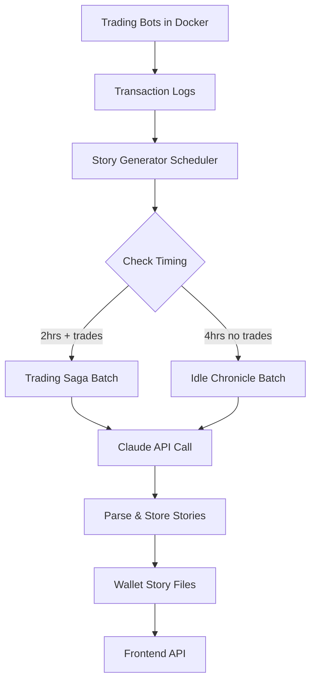

# 🏴‍☠️ **Complete Story Generation API Documentation**

## 🎯 **Overview**

The Fafnir Bot now includes a comprehensive backend story generation system that:
- **Monitors Docker containers** and trading activities automatically
- **Generates stories every 2 hours** if there were trades, **every 4 hours** if idle
- **Uses Claude API** for high-quality fantasy narrative generation
- **Batches requests** to minimize AI API costs
- **Stores stories per wallet** indefinitely
- **Allows full customization** of prompts and parameters

## 🔧 **Setup Requirements**

### **1. Environment Variables**
```bash
# Add to your .env file
ANTHROPIC_API_KEY=your_claude_api_key_here
# OR
CLAUDE_API_KEY=your_claude_api_key_here
```

### **2. Start the API Server**
```bash
npm run start:api
```

The story generator automatically starts and begins monitoring for trading activity.

## 📡 **API Endpoints**

### **Story Retrieval**

#### **Get Wallet Stories**
```
GET /api/stories/wallet/:address?limit=10
```
**Response:**
```json
{
  "success": true,
  "data": {
    "stories": [
      {
        "id": "story_1725688964471_abc123def",
        "timestamp": "2025-09-07T05:22:44.471Z",
        "storyType": "trading_saga",
        "title": "The Fafnir's Dawn Raid",
        "content": "As the first light of dawn broke over the mystical realm of GalaSwap...",
        "metadata": {
          "tradesIncluded": 3,
          "profitLoss": 2.15,
          "heroicMoments": ["perfect_timing", "strategic_brilliance"],
          "questOutcome": "victory"
        }
      }
    ],
    "walletAddress": "eth|978BB9ec5AF287EBff8f5C3BeC2568EED56aE4a9"
  }
}
```

### **Story Preferences**

#### **Update Wallet Preferences**
```
POST /api/stories/wallet/:address/preferences
```
**Body:**
```json
{
  "tone": "epic",
  "length": "medium",
  "focusArea": "adventure",
  "characterType": "warrior"
}
```

**Options:**
- **tone**: `epic` | `casual` | `technical` | `humorous`
- **length**: `short` | `medium` | `long`
- **focusArea**: `profit` | `adventure` | `strategy` | `risk`
- **characterType**: `warrior` | `merchant` | `wizard` | `rogue`

### **Manual Story Generation**

#### **Force Generate Story**
```
POST /api/stories/wallet/:address/generate
```
**Body:**
```json
{
  "storyType": "trading_saga"
}
```
**Options:**
- **storyType**: `trading_saga` | `idle_chronicle`

### **Claude Configuration**

#### **Get Current Claude Config**
```
GET /api/stories/claude/config
```
**Response:**
```json
{
  "success": true,
  "data": {
    "model": "claude-3-5-sonnet-20241022",
    "maxTokens": 2000,
    "temperature": 0.8,
    "systemPrompt": "You are a master storyteller...",
    "userPromptTemplate": "Generate fantasy stories..."
  }
}
```

#### **Update Claude Configuration**
```
PUT /api/stories/claude/config
```
**Body:**
```json
{
  "model": "claude-3-haiku-20240307",
  "maxTokens": 1500,
  "temperature": 0.9
}
```

#### **Update System Prompt**
```
PUT /api/stories/claude/system-prompt
```
**Body:**
```json
{
  "systemPrompt": "You are an epic fantasy storyteller who transforms trading data into legendary tales of digital treasure hunters in the mystical realm of GalaSwap..."
}
```

#### **Update User Prompt Template**
```
PUT /api/stories/claude/user-prompt
```
**Body:**
```json
{
  "userPromptTemplate": "Transform the following trading data into {STORY_COUNT} epic fantasy stories:\n\n{TRADING_DATA}\n\nMake each story unique and engaging..."
}
```

## 🤖 **How the Backend Monitoring Works**

### **1. Docker Container Monitoring**
The API server already monitors Docker containers using:
```javascript
// Existing functionality in api-server.ts
const dockerPs = spawn('docker', ['ps', '--format', 'table {{.Names}}\t{{.Status}}\t{{.CreatedAt}}']);
```

### **2. Transaction Log Monitoring**
The system watches multiple log sources:
- `logs/transactions.json` - Main transaction log
- `logs/multi-user/trades-{address}.log` - Per-user trade logs
- `logs/trades.log` - Human-readable trade log

### **3. Automatic Story Scheduling**
```javascript
// Runs every 30 minutes to check for story generation needs
setInterval(async () => {
  await this.processScheduledStories();
}, 30 * 60 * 1000);
```

**Logic:**
- **2 hours with trades** → Generate "trading_saga"
- **4 hours without trades** → Generate "idle_chronicle"

### **4. Batch Processing for Cost Optimization**
```javascript
// Groups similar requests to minimize AI API calls
const batchRequests = groupWalletsByStoryType(activeWallets);
const batchStories = await this.callClaudeAPI(batchPrompt, walletCount);
```

## 📊 **Data Flow Architecture**



## 🎨 **Customizing Your Prompts**

### **Example: Epic Fantasy Focus**
```javascript
// Update system prompt for more epic storytelling
PUT /api/stories/claude/system-prompt
{
  "systemPrompt": "You are Gandalf the Grey, master of digital realms and blockchain magic. Transform mundane trading transactions into epic tales worthy of Middle-earth. Each trade is a quest, each profit a treasure won through wisdom and courage. Speak in the voice of ancient wisdom, weaving tales that would inspire even the bravest hobbits to venture into the dangerous world of cryptocurrency trading."
}
```

### **Example: Technical Analysis Focus**
```javascript
// Update for more technical storytelling
PUT /api/stories/claude/system-prompt
{
  "systemPrompt": "You are a master strategist and technical analyst who sees trading patterns as battlefield formations and market movements as epic campaigns. Transform trading data into military-style adventure stories where RSI levels are scout reports, Bollinger Bands are fortress walls, and successful trades are victorious battles won through superior tactics and timing."
}
```

### **Example: Humorous Approach**
```javascript
PUT /api/stories/claude/system-prompt
{
  "systemPrompt": "You are a witty tavern storyteller who finds humor in the absurdity of digital trading. Transform trading transactions into comedic adventures where tokens have personalities, slippage is a mischievous imp, and failed trades are slapstick comedy routines. Keep it light-hearted while still respecting the real financial outcomes."
}
```

## 🔄 **Real-time Integration**

### **WebSocket Updates**
The system broadcasts story generation events:
```javascript
ws.onmessage = (event) => {
  const update = JSON.parse(event.data);
  if (update.type === 'story_generated') {
    console.log(`New story for wallet ${update.walletAddress}: ${update.title}`);
  }
};
```

### **Frontend Integration Example**
```javascript
// Get stories for connected wallet
const getWalletStories = async (walletAddress) => {
  const response = await fetch(`/api/stories/wallet/${walletAddress}?limit=5`);
  const data = await response.json();
  return data.data.stories;
};

// Update user preferences
const updateStoryPreferences = async (walletAddress, preferences) => {
  await fetch(`/api/stories/wallet/${walletAddress}/preferences`, {
    method: 'POST',
    headers: { 'Content-Type': 'application/json' },
    body: JSON.stringify(preferences)
  });
};

// Force generate a new story
const generateStory = async (walletAddress) => {
  const response = await fetch(`/api/stories/wallet/${walletAddress}/generate`, {
    method: 'POST',
    headers: { 'Content-Type': 'application/json' },
    body: JSON.stringify({ storyType: 'trading_saga' })
  });
  return response.json();
};
```

## 💰 **Cost Optimization Features**

1. **Batch Processing**: Multiple wallets processed in single API call
2. **Smart Scheduling**: Only generates when needed (2hr/4hr intervals)
3. **Caching**: Stories stored locally, no regeneration needed
4. **Fallback System**: If Claude API fails, generates simple placeholder stories
5. **Configurable Models**: Use cheaper Haiku model for simple stories, Sonnet for complex ones

## 🎯 **Perfect for Your Content Generator**

This system gives you:
- **Automatic story generation** tied to actual trading activity
- **Rich, detailed narratives** based on real transaction data
- **Full customization control** over tone, style, and content
- **Cost-effective batch processing** to minimize AI API expenses
- **Wallet-specific story history** stored indefinitely
- **Real-time updates** via WebSocket for live content

The backend handles all the complexity while giving your frontend clean, engaging stories ready for display! 🏴‍☠️✨
